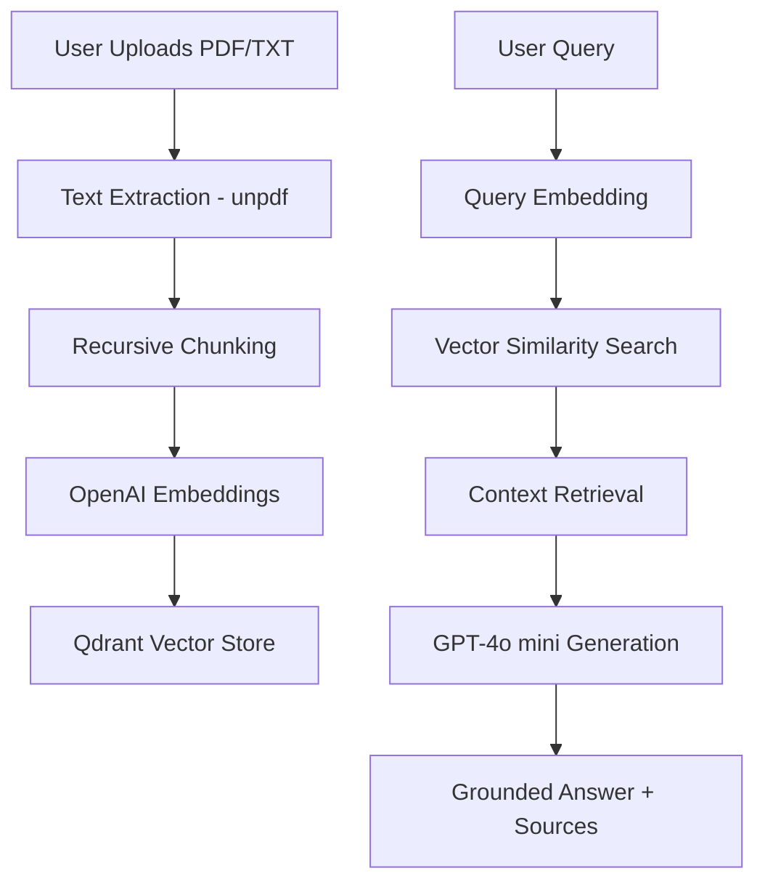

# NotebookRAG 📚

A high-performance, grounded AI document assistant built with **Next.js**, **OpenAI**, and **Qdrant**. This application implements a full RAG (Retrieval-Augmented Generation) pipeline to provide accurate, cited answers based strictly on uploaded documents.


## 🚀 Key Features
- **Semantic Search**: Uses OpenAI `text-embedding-3-small` to find relevant context with high precision.
- **Grounded AI**: Powered by `gpt-4o-mini`, ensuring answers are factually tied to your documents.
- **Citations & Sources**: Automatic source attribution with clickable document excerpts.
- **Modern PDF Parsing**: Robust extraction using `unpdf` (supports modern PDF/A and XRef formats).
- **Glassmorphic UI**: Premium dark-mode interface with real-time indexing feedback.

## 🛠️ Architecture
The system follows a standard RAG architecture optimized for serverless deployment:



## 🏗️ Tech Stack
- **Frontend/API**: [Next.js](https://nextjs.org/) (App Router & Turbopack)
- **AI/LLM**: [OpenAI API](https://openai.com/)
- **Vector Database**: [Qdrant Cloud](https://qdrant.tech/)
- **Text Processing**: [unpdf](https://github.com/unjs/unpdf) & [RecursiveCharacterTextSplitter](https://github.com/langchain-ai/langchainjs)
- **Styling**: Vanilla CSS (Modern Design System)

## 📋 Installation & Setup

1. **Clone the repository**:
   ```bash
   git clone https://github.com/your-username/NotebookRAG.git
   cd NotebookRAG
   ```

2. **Install dependencies**:
   ```bash
   npm install
   ```

3. **Configure Environment Variables**:
   Create a `.env.local` file:
   ```env
   OPENAI_API_KEY=sk-your-key
   QDRANT_URL=https://your-cluster-url.qdrant.io:6333
   QDRANT_API_KEY=your-api-key
   ```

4. **Run the app**:
   ```bash
   npm run dev
   ```

## 🧠 Technical Highlights (For Submission)
- **Vector Indexing**: Implemented Payload Indexing in Qdrant to allow for O(1) document filtering.
- **Serverless Optimization**: Optimized the PDF processing pipeline to run within Vercel's execution limits by using zero-dependency, non-worker-based parsers.
- **Grounded Prompting**: Utilized system-level constraints to prevent AI hallucinations, ensuring the assistant only answers using provided context.
